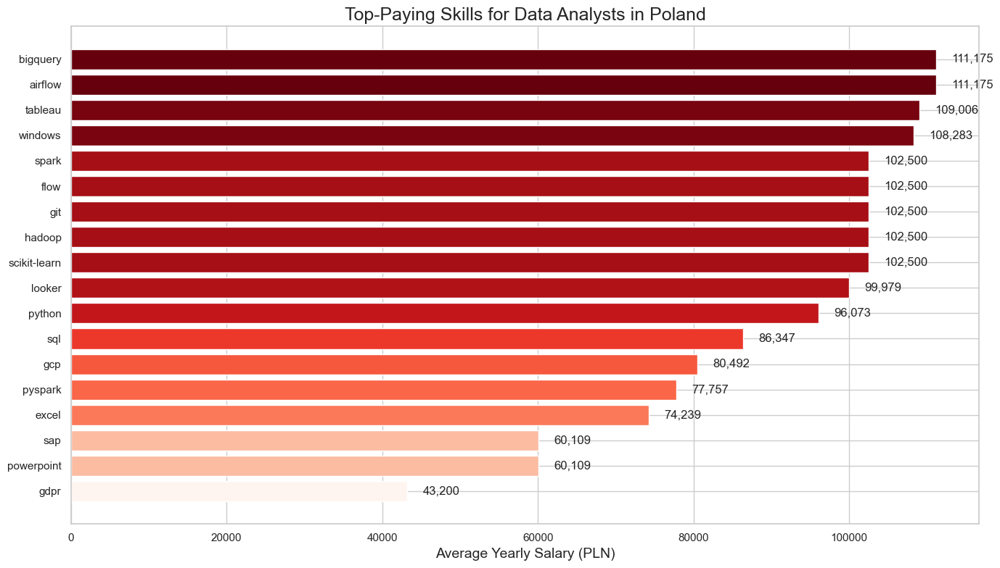

# **Skills in the Data Job Market in Poland**
# Introduction
Let's embark on an exploration of the data job market. In this project, I delve into job postings from 2023 to uncover valuable insights into top-paying roles, in-demand skills, and where high demand meets high salaries in data analytics within the Polish job market.

# Background
Entering the data job market, especially after a career change, can be challenging. What are hiring companies looking for? Which skills should I prioritize learning? What are the top-paid skills? To better navigate the data job market, this project analyzes job postings to identify crucial details such as salaries and skills. 
The research results are split into:
A) for all data-related professions in Poland
B) narrowed down to the Data Analyst profession I aspire to.

Data source and guidance: [Luke Barousse SQL Course](https://www.lukebarousse.com/sql)

### **Questions I wanted to answer through this project:**
**1. What are the top-paying data jobs in Poland?**
- A) What are the top-paying data job offers in Poland?
- B) Identify the top highest-paying job offers specifically for Data Analysts

**2. What skills are required for these exact top-paying data jobs in Poland?**
- A detailed examination of the skills demanded by high-paying jobs from previous query, aiding job seekers in understanding which skills to develop for aligning with top salaries.
- A) What skills are required for these highest-paying data jobs in Poland?
- B) What skills are required for top-paying Data Analyst job offers in Poland?

**3. What skills are the most in demand for data jobs?**
- A) Display top 10 skills by their demand in the Polish data job market 
- B) What are the most in-demand skills for Data Analysts?

**4. Which skills are associated with higher salaries?**
- A) Identify the most financially rewarding skills to acquire or improve for data nerds in Poland
- B) Which skills are associated with bigger pay specifically for Data Analysts?

**5. What are the most optimal skills to learn?**
- Focus on skills that offer both job security (high demand) and financial benefits (high salaries) in Poland.
- Discover the best skills for Data Analysts to pursue 

# Tools I Used

To dive into the data analyst job market, I navigated the currents using several key tools:
- SQL
- PostgreSQL
- VS Code
- GitHub
- Pandas and Matplotlib for visualisation in Python

# The Analysis

Each query for this project was like setting sail to explore specific aspects of the data analyst job market. Here's how I charted a course for each question.

### 1. Top Paying Data Jobs in Poland
In order to find the top paying jobs, I wrote a query to filter top data analyst jobs by average yearly salary and location. This query showcases the lucrative positions in the data field in Poland.

**All data jobs:**
```sql
SELECT
    job_id,
    job_title,
    job_location,
    job_schedule_type,
    salary_year_avg,
    job_posted_date,
    company_dim.name as company_name
FROM 
    job_postings_fact
LEFT JOIN company_dim ON company_dim.company_id = job_postings_fact.company_id
WHERE job_location = 'Poland'
AND salary_year_avg IS NOT NULL
ORDER BY salary_year_avg DESC
```

**Top Salaries:**
The highest-paying role is "Head of Data Platform and Cloud" at Palta with 221,000 PLN annually.
Roles like "Corporate Audit, AVP – Full Stack Data Scientist" and "Machine Learning Engineer" offer salaries around 186,000 PLN.

**High Demand for ML & AI Skills:**
Roles such as Machine Learning Engineer and AI Engineer are among the top-paying jobs, reflecting the strong demand for expertise in these areas.

**Major Employers:**
Allegro is a key player with multiple high-paying roles, indicating its significant investment in data talent. Other notable employers include HEINEKEN and Warner Bros. Discovery.

**Salary Range:**
Yearly salaries in the dataset range from 132,500 PLN to 221,000 PLN, with a focus on roles in data engineering, machine learning, and AI.

**Part-Time Opportunity:**
Even part-time roles, like "Big Data / AI Engineer" at Warner Bros. Discovery, offer competitive salaries (164,500 PLN), highlighting the value of specialized skills.

This data suggests that leadership roles in data management, as well as specialized positions in machine learning, AI, and data engineering, are the most lucrative in Poland’s data job market. Companies like Allegro, HEINEKEN, and Warner Bros. Discovery are leading employers, and there is a clear trend toward high-paying opportunities in both full-time and part-time positions, particularly in roles that demand advanced technical skills.

**Data Analysts:**
```sql
SELECT
    job_id,
    job_title,
    job_location,
    job_schedule_type,
    salary_year_avg,
    job_posted_date,
    company_dim.name as company_name
FROM 
    job_postings_fact
LEFT JOIN company_dim ON company_dim.company_id = job_postings_fact.company_id
WHERE job_location = 'Poland'
AND job_title_short = 'Data Analyst'
AND salary_year_avg IS NOT NULL
ORDER BY salary_year_avg DESC
```


**Top Salaries:** The highest-paying data analyst positions offer a yearly salary of around PLN 111,175, with multiple roles at Allegro leading this category.

**Dominance of Allegro:** Allegro is the dominant employer, offering the majority of the top-paying roles, especially for senior positions.

**Salary Range:** The salaries for data analyst positions range from PLN 111,175 at the high end to PLN 43,200 at the low end, indicating a significant disparity based on experience, specialization, and the company.

**Junior Roles:** The lowest salaries are associated with junior roles, such as HR Data Analyst and Junior Data Analyst, indicating the entry-level pay scale within this field.

**Industry Focus:** The data suggests a strong presence of data analyst roles in e-commerce (Allegro) and technology (Capco, Westinghouse Electric Company), with a focus on specialized areas like finance and pricing.

### 2. Skills for Top Paying Jobs
To identify the skills needed for the highest-paying jobs, I joined job postings with skills data, revealing what employers prioritize for well-compensated positions.

**All data jobs:**
```sql
WITH top_paying_jobs AS ( 
    SELECT
        job_id,
        job_title,
        salary_year_avg,
        company_dim.name as company_name
    FROM 
        job_postings_fact
    LEFT JOIN company_dim ON company_dim.company_id = job_postings_fact.company_id
    WHERE 
    job_location = 'Poland'
    AND salary_year_avg IS NOT NULL
    ORDER BY salary_year_avg DESC
    LIMIT 10
)

SELECT
    top_paying_jobs.*,
    skills
FROM top_paying_jobs
INNER JOIN skills_job_dim ON top_paying_jobs.job_id = skills_job_dim.job_id
INNER JOIN skills_dim ON skills_job_dim.skill_id = skills_dim.skill_id
ORDER BY
    salary_year_avg DESC
```


**Cloud Platforms:**
AWS, Azure, and GCP are crucial for top-paying roles, reflecting the importance of cloud expertise.

**Data Processing and Storage:**
Proficiency in Databricks, Snowflake, Spark, Hadoop, and BigQuery is highly valued, showcasing a strong demand for advanced data processing and storage skills.

**Data Visualization and Tools:**
Skills in Looker, Tableau, Power BI, and Git are essential for roles involving data visualization and version control.

**Programming Languages:**
Python and SQL are consistently required across various positions, highlighting their importance in data roles.

**Emerging Technologies:**
Familiarity with Terraform and Airflow is increasingly sought after, indicating a trend towards newer tools and technologies.
In summary, cloud expertise, advanced data processing, and strong programming skills, along with experience in emerging tools, are key to securing high-paying data positions in Poland.

**Data Analysts:**
```sql
WITH top_paying_jobs AS (
    SELECT
        job_id,
        job_title,
        salary_year_avg,
        company_dim.name as company_name
    FROM 
        job_postings_fact
    LEFT JOIN company_dim ON company_dim.company_id = job_postings_fact.company_id
    WHERE 
    job_title_short = 'Data Analyst' AND 
    job_location = 'Poland'
    AND salary_year_avg IS NOT NULL
    ORDER BY salary_year_avg DESC
    LIMIT 10
)

SELECT
    top_paying_jobs.*,
    skills
FROM top_paying_jobs
INNER JOIN skills_job_dim ON top_paying_jobs.job_id = skills_job_dim.job_id
INNER JOIN skills_dim ON skills_job_dim.skill_id = skills_dim.skill_id
ORDER BY
    salary_year_avg DESC
```


**SQL:** SQL is the most frequently mentioned skill across high-paying data analyst job offers. It is a core skill for querying and managing databases, reflecting its critical role in data analysis tasks.

**Python:** Python is another highly sought-after skill, emphasizing its importance in data manipulation, analysis, and automation. Its popularity is driven by its versatility and the wide range of data science libraries it supports.

**GCP (Google Cloud Platform):** GCP appears consistently in job requirements, indicating a strong preference for experience with cloud platforms. This suggests that cloud computing and data storage in a scalable environment are essential for these roles.

**Tableau and Looker:** Both Tableau and Looker are mentioned frequently, highlighting the importance of data visualization tools in these positions. Proficiency in these tools is crucial for presenting data insights effectively.


### 3. In-Demand Skills for Data Analysts
This query pinpoints the most frequently requested skills in job postings, helping to find the most demanded ones.

**All data jobs:**
```sql
SELECT 
    skills,
    COUNT(skills_job_dim.job_id) AS demand_count
FROM job_postings_fact
INNER JOIN skills_job_dim ON job_postings_fact.job_id = skills_job_dim.job_id
INNER JOIN skills_dim ON skills_job_dim.skill_id = skills_dim.skill_id
AND job_country = 'Poland'
GROUP BY skills
ORDER BY demand_count DESC
LIMIT 10
```


In the Polish data job market, SQL and Python are the most sought-after skills, each with exceptionally high demand. SQL leads with 7,500 mentions, highlighting its essential role in data management and querying. Python follows closely with 7,295 mentions, reflecting its widespread use in data analysis and scripting.

Cloud platforms such as Azure and AWS also feature prominently, with 3,701 and 3,459 mentions respectively, indicating a strong preference for professionals with cloud computing skills. Apache Spark, a popular big data processing framework, has a notable demand with 2,547 mentions, showcasing the importance of big data technologies.

Excel remains a staple skill with 2,406 mentions, emphasizing its enduring relevance in data manipulation and analysis. Java, while less demanded than the leading skills, still has a significant presence with 1,958 mentions, likely due to its use in data engineering and development roles.

Google Cloud Platform (GCP) has a solid demand of 1,939 mentions, reinforcing the importance of cloud expertise. Finally, data visualization tools Tableau and Power BI are also in demand, with 1,807 and 1,702 mentions respectively, underlining the need for proficiency in presenting data insights effectively.

Overall, this data illustrates a robust demand for a mix of traditional data skills, cloud technologies, and data visualization tools, reflecting current trends and needs in the data job market in Poland.

**Data Analysts:**
```sql
SELECT 
    skills,
    COUNT(skills_job_dim.job_id) AS demand_count
FROM job_postings_fact
INNER JOIN skills_job_dim ON job_postings_fact.job_id = skills_job_dim.job_id
INNER JOIN skills_dim ON skills_job_dim.skill_id = skills_dim.skill_id
WHERE job_location = 'Poland' AND job_title_short = 'Data Analyst'
GROUP BY skills
ORDER BY demand_count DESC
LIMIT 10
```


The demand for data analyst skills in Poland is led by SQL, Python, and Excel, which are highly sought after across job postings.

SQL stands out as the most demanded skill with 131 mentions, reflecting its essential role in querying and managing databases.
Python follows with 85 mentions, highlighting its importance for data manipulation, analysis, and automation tasks.
Excel is also in high demand, with 73 mentions, indicating its continued relevance for data handling and basic analysis.

Other skills such as Tableau (56 mentions) and Power BI (46 mentions) are important for data visualization but are less frequently mentioned compared to SQL, Python, and Excel. Skills like GCP (36 mentions) and R (28 mentions) are also valuable but show a more niche demand. Windows, Looker, and Azure have lower demand counts, suggesting they are less critical compared to the top skills but still relevant in specific contexts.

This distribution underscores the broad reliance on SQL and Python for core data analysis tasks, while also emphasizing the importance of visualization tools and cloud platforms in the job market.

### 4. Skills Based On Salary
In previous section I searched for the most frequently mentioned skills in job postings. Now I'm going to breakdown the top-paid ones, exploring the average salaries associated with different skills.


**All data jobs:**
```sql
SELECT 
    skills_dim.skills,
    ROUND(AVG(salary_year_avg), 0) as avg_salary
FROM job_postings_fact
INNER JOIN skills_job_dim ON job_postings_fact.job_id = skills_job_dim.job_id
INNER JOIN skills_dim ON skills_job_dim.skill_id = skills_dim.skill_id
WHERE salary_year_avg IS NOT NULL 
AND 
job_location = 'Poland'
GROUP BY skills_dim.skills
ORDER BY avg_salary DESC
LIMIT 25
```


**Top Salaries:**
Databricks offers the highest average salary (178,732 PLN), followed by Snowflake (162,335 PLN) and Azure (158,099 PLN).

**Cloud and Data Platforms:**
Skills in Snowflake, Azure, and AWS are highly valued, highlighting the premium on cloud and advanced data tools.

**Database Management:**
NoSQL and MySQL also command high salaries, indicating strong demand for database expertise.

**Business Intelligence:**
Power BI and Tableau are well-compensated, reflecting the importance of data visualization skills.

**Specialized Skills:**
Advanced frameworks like PySpark, Theano, and PyTorch offer competitive salaries, though slightly lower than top platforms.

**Programming Languages:**
Python and R are valuable but less lucrative compared to specialized tools.

In summary, advanced data tools and cloud platforms dominate the highest-paying roles, while traditional skills like SQL and Python are valuable but slightly less compensated.

**Data Analysts:**
```sql
SELECT
    skills_dim.skills,
    ROUND(AVG(salary_year_avg), 0) as avg_salary
FROM job_postings_fact
INNER JOIN skills_job_dim ON job_postings_fact.job_id = skills_job_dim.job_id
INNER JOIN skills_dim ON skills_job_dim.skill_id = skills_dim.skill_id
WHERE salary_year_avg IS NOT NULL
AND job_location = 'Poland'
AND job_title_short = 'Data Analyst'
GROUP BY skills_dim.skills
ORDER BY avg_salary DESC
```


**Highest Salaries:**
BigQuery and Airflow are the top-paid skills, both with an average salary of PLN 111,175.

**High-Paying Skills:**
Tableau and Windows offer competitive salaries around PLN 108,000 to PLN 111,000.
Spark, Flow, Git, Hadoop, and Scikit-learn all command an average salary of PLN 102,500.

**Mid-Range Salaries:**
Looker and Python earn about PLN 100,000 and PLN 96,000, respectively.
SQL and GCP offer salaries of PLN 86,000 and PLN 80,000.

**Lower Range Salaries:**
Excel and Pyspark have average salaries of around PLN 74,000 and PLN 77,000.
SAP, PowerPoint, and GDPR are among the lower-paying skills, with salaries ranging from PLN 60,000 to PLN 43,200.

Overall, specialized skills in data management and analysis, such as BigQuery and Airflow, significantly boost earning potential for data analysts in Poland.

### 5. The Most Optimal Skills to Learn
Let's merge insights on the most sought-after and highest-paying skills to identify which ones offer job security (high demand) and financial benefits (high salaries), providing strategic insights for career development in data analysis.

**All data jobs:**
```sql
WITH skills_demand as (
    SELECT 
        skills_dim.skill_id,
        skills_dim.skills,
        COUNT(skills_job_dim.job_id) AS demand_count
    FROM job_postings_fact
    INNER JOIN skills_job_dim ON job_postings_fact.job_id = skills_job_dim.job_id
    INNER JOIN skills_dim ON skills_job_dim.skill_id = skills_dim.skill_id
    WHERE salary_year_avg IS NOT NULL
    AND job_location = 'Poland'
    GROUP BY skills_dim.skill_id
)

, average_salary as (
    SELECT
        skills_job_dim.skill_id,
        ROUND(AVG(salary_year_avg), 0) as avg_salary
    FROM job_postings_fact
    INNER JOIN skills_job_dim ON job_postings_fact.job_id = skills_job_dim.job_id
    INNER JOIN skills_dim ON skills_job_dim.skill_id = skills_dim.skill_id
    WHERE salary_year_avg IS NOT NULL
    AND job_location = 'Poland'
    GROUP BY skills_job_dim.skill_id
)

SELECT 
    skills_demand.skill_id,
    skills_demand.skills,
    demand_count,
    avg_salary
FROM
    skills_demand
INNER JOIN average_salary ON average_salary.skill_id = skills_demand.skill_id
WHERE demand_count > 10
ORDER BY
    avg_salary DESC,
    demand_count DESC
    
```


**High Earning Potential:** Tableau stands out with the highest average salary at PLN 131,687, making it the top skill for high earning potential.

**Strong Demand:** Python and SQL are in high demand, each with 31 job postings, and both offer competitive salaries (PLN 119,526 and PLN 118,758, respectively).

**Solid Salary and Demand:** Spark and Hadoop offer robust salaries (PLN 112,729 and PLN 111,046) and decent demand, making them valuable skills to acquire.

**Emerging Technologies:** Skills like BigQuery and GCP provide good salaries (PLN 108,056 and PLN 100,837) with moderate demand, highlighting their growing importance.

**Less Common but Valuable:** Scala and Windows have lower demand (13 postings each) but still offer respectable salaries, showing niche areas where expertise is rewarded.

Overall, focusing on skills like Tableau, Python, and SQL can provide the best balance of high salary and strong demand in the Polish data job market.

**Data Analysts:**
```sql
WITH skills_demand as (
    SELECT 
        skills_dim.skill_id,
        skills_dim.skills,
        COUNT(skills_job_dim.job_id) AS demand_count
    FROM job_postings_fact
    INNER JOIN skills_job_dim ON job_postings_fact.job_id = skills_job_dim.job_id
    INNER JOIN skills_dim ON skills_job_dim.skill_id = skills_dim.skill_id
    WHERE job_title_short = 'Data Analyst' AND salary_year_avg IS NOT NULL
    AND job_country = 'Poland'
    GROUP BY skills_dim.skill_id
)

, average_salary as (
    SELECT
        skills_job_dim.skill_id,
        ROUND(AVG(salary_year_avg), 0) as avg_salary
    FROM job_postings_fact
    INNER JOIN skills_job_dim ON job_postings_fact.job_id = skills_job_dim.job_id
    INNER JOIN skills_dim ON skills_job_dim.skill_id = skills_dim.skill_id
    WHERE job_title_short = 'Data Analyst' AND salary_year_avg IS NOT NULL
    AND job_country = 'Poland'
    GROUP BY skills_job_dim.skill_id
)

SELECT 
    skills_demand.skill_id,
    skills_demand.skills,
    demand_count,
    avg_salary
FROM
    skills_demand
INNER JOIN average_salary ON average_salary.skill_id = skills_demand.skill_id
WHERE demand_count > 10
ORDER BY
    avg_salary DESC,
    demand_count DESC
    
```


SQL and Python are the most optimal skills, showing high demand and competitive salaries. SQL leads in demand count, while Python offers a higher salary.
Tableau and Excel are valuable but slightly less lucrative. Tableau, despite having fewer job postings, commands a higher salary compared to Excel.
SQL is highly demanded and offers a solid average salary, making it a key skill to focus on.
Python is also crucial, with strong salary potential and substantial demand.
Focusing on SQL and Python will maximize both job opportunities and earning potential in the Polish data analyst job market.

# What I Learned

Throughout this cruise I refreshed my SQL knowledge by
- Practicing table merging and using the WITH clause.
- Applying aggregate functions (e.g., COUNT(), AVG(), along with GROUP BY) for data analysis.
- Turning questions into SQL queries.
- Exporting SQL results to JSON for further use in Python.

Additionally, I learned how to create simple visualizations in Python using Pandas and Matplotlib.

What's more, I found out how to use VS Code and how to write a good README for my GitHub project.

# Conclusions

Overall, the most commonly required skill in the job market for any data role is timeless SQL, crucial for data management and querying. Excel remains fundamental for data analysts, used for reporting, and financial modeling. Python is highly demanded for data science, machine learning, automation, and data analysis, and is versatile across various fields. The strong demand for data visualization and business intelligence supporting data-driven decisions makes Tableau and Power BI other top-demanded skills to have on your resume.

Taking fincancial aspect into account, skills like Python and Tableau offer a strong combination of demand and salary. Although SQL is the keystone of data analysis, it is so common and classic that it doesn't result in a high paycheck. Traditional tools like Excel remain relevant, while modern tools like and cloud platforms are growing in importance. Spark and Hadoop provide strong salaries and are valuable skills as well. BigQuery and GCP offer good salaries (PLN 108,056 and PLN 100,837) with moderate demand.
Scala and Windows, while less in demand, offer respectable salaries.

In the Polish data job market Tableau offers the highest average salary (PLN 131,687), making it the most lucrative skill.
Python and  SQL are in high demand and offer competitive salaries (PLN 119,526 and PLN 118,758, respectively).

For data analysts specifically, SQL and Python are the most optimal skills, offering a strong balance of high demand and good salaries. Tableau and Excel are also valuable, with Tableau commanding a higher salary despite fewer job postings. Focusing on SQL and Python will maximize both job opportunities and earning potential in this field.


### Closing Thoughts

Frankly speaking, this project boosted my SQL skills and taught me how to complete projects in general! This is my first one ever, and I'm very excited about it. What's more, when I started my data analysis journey a few months ago, I was lost in the various (often contradictory) advice on the Internet about what to learn, how, in which order, and where to start. I ended up spending lots of time on skills that weren't actually needed for my first data analysis job. The results of this analysis provide a roadmap for prioritizing skill development. This exploration emphasizes the necessity of continuous learning and staying up-to-date with emerging trends in the field of data analytics.
